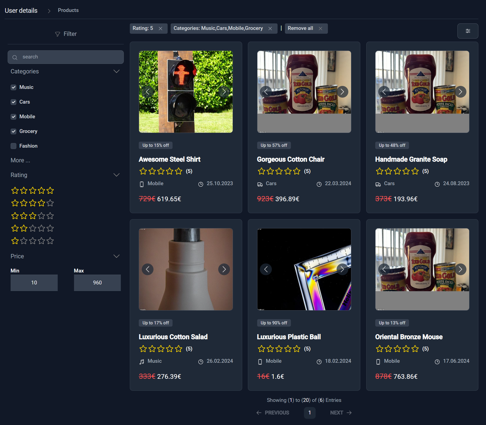

# SS-Admin-Dashboard Project

This project is an administrative dashboard designed to demonstrate proficiency in modern web development frameworks and libraries, specifically Angular, Tailwind CSS, NgRx, and Nx workspace. The dashboard serves as a showcase of the developer's skills, featuring a responsive design, state management, and modular architecture.

## Features

- **Angular**: Utilizes the latest Angular framework for a component-based architecture, ensuring efficient rendering and reusability.
- **Tailwind CSS**: Implements Tailwind CSS for a customizable and low-level utility-first approach, enabling a sleek and modern design.
- **NgRx**: Employs NgRx for state management, providing a single source of truth for the application's state, along with powerful debugging capabilities.
- **Nx Workspace**: Leverages Nx workspace to streamline the development process, allowing for code reusability and better organization across multiple projects.

## Libraries

- **luxon**: is a library for working with dates and times in JavaScript. 
- **ng-icon**: this allows to use icons from heroicons sets with a single icon component
- **flowbite**: a Tailwind CSS plugin to help build websites faster by having a set of web components to work with built with the utility classes from Tailwind CSS.
- **apexcharts**: a modern JavaScript charting library

## Installation

To get started with this project, clone the repository and install the dependencies:

```
git clone https://github.com/sammours/ss-admin-dashboard.git
cd ss-admin-dashboard
npm install
```

## Usage

After installation, run the following command to start the development server:

```
nx serve ss-admin-dashboard
```

Navigate to `http://localhost:4200/` to view the dashboard.

## Contributing

Contributions to enhance the functionality or design of the dashboard are welcome. Please read the contributing guidelines before submitting your proposals.

## License

This project is licensed under the MIT License - see the LICENSE.md file for details.

---

For a detailed explanation of the project's structure and features, please refer to the documentation provided in the docs directory.

Thank you for exploring this admin dashboard project. Your feedback and contributions are highly appreciated.

## Dashboard
 
 
 

## User
 
 

## Product
 
 
  

## Order
 
 

## Inbox
 

## Layout
 

 
 